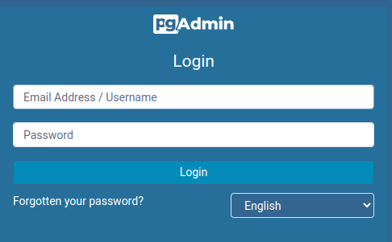
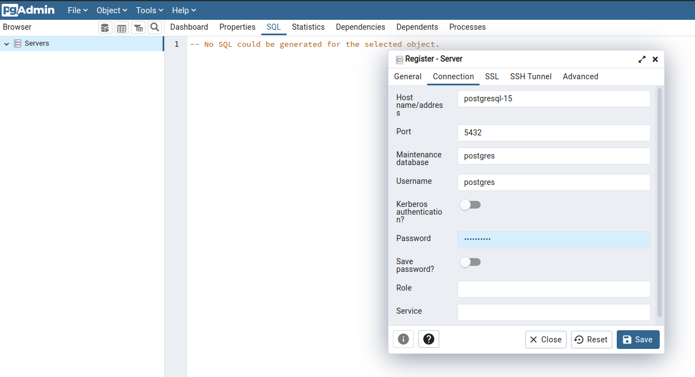
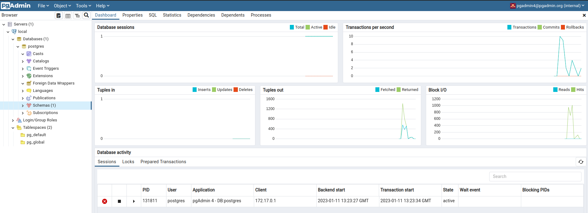

## Install Helm

Please see [Helm documentation](https://helm.sh/docs/intro/install/)

## PostgreSQL

### install via helm

```shell
helm repo add bitnami https://charts.bitnami.com/bitnami
helm install -f ./helm/postgres/values.yaml postgresql bitnami/postgresql --debug
```

installation output:
```
** Please be patient while the chart is being deployed **

PostgreSQL can be accessed via port 5432 on the following DNS names from within your cluster:

    postgresql.default.svc.cluster.local - Read/Write connection

To get the password for "postgres" run:

    export POSTGRES_PASSWORD=$(kubectl get secret --namespace default postgresql -o jsonpath="{.data.postgres-password}" | base64 -d)

To connect to your database run the following command:

    kubectl run postgresql-client --rm --tty -i --restart='Never' --namespace default --image docker.io/bitnami/postgresql:15.1.0-debian-11-r19 --env="PGPASSWORD=$POSTGRES_PASSWORD" \
      --command -- psql --host postgresql -U postgres -d postgres -p 5432

    > NOTE: If you access the container using bash, make sure that you execute "/opt/bitnami/scripts/postgresql/entrypoint.sh /bin/bash" in order to avoid the error "psql: local user with ID 1001} does not exist"

To connect to your database from outside the cluster execute the following commands:

    kubectl port-forward --namespace default svc/postgresql 5432:5432 &
    PGPASSWORD="$POSTGRES_PASSWORD" psql --host 127.0.0.1 -U postgres -d postgres -p 5432

```

install pgAdmin
```shell
helm repo add cetic https://cetic.github.io/helm-charts
helm install pgadmin cetic/pgadmin
```

output:
```
1. Get the application URL by running these commands:
  NOTE: It may take a few minutes for the LoadBalancer IP to be available.
         You can watch the status of by running 'kubectl get svc -w pgadmin'

  export SERVICE_IP=$(kubectl get svc --namespace default pgadmin --template "{{ range (index .status.loadBalancer.ingress 0) }}{{.}}{{ end }}")
  echo "pgAdmin URL: http://$SERVICE_IP:80"

** Please be patient while the chart is being deployed **

```

INFO: if You have trouble with authentication after reinstalling, it may be caused by persistent volume from previous installation, please run 
```shell
kubectl get pv
kubectl get pvc
````
to check, and delete by (use specific pv and pvc from above):
```shell
kubectl delete pvc data-postgresql-0
kubectl delete pv pvc-1fa4e021-499a-44f8-8282-b32144de22be
````


### Test locally

Let's login to pgAdmin, check first cluster by `kubectl get all`

```
NAME                           READY   STATUS    RESTARTS   AGE
pod/pgadmin-7b867bd6d8-6qjz4   1/1     Running   0          20m
pod/postgresql-0            1/1     Running   0          4d17h

NAME                       TYPE           CLUSTER-IP      EXTERNAL-IP   PORT(S)        AGE
service/kubernetes         ClusterIP      10.96.0.1       <none>        443/TCP        9d
service/pgadmin            LoadBalancer   10.109.20.232   <pending>     80:32025/TCP   20m
service/postgresql      ClusterIP      10.111.170.37   <none>        5432/TCP       4d17h
service/postgresql-hl   ClusterIP      None            <none>        5432/TCP       4d17h

NAME                      READY   UP-TO-DATE   AVAILABLE   AGE
deployment.apps/pgadmin   1/1     1            1           20m

NAME                                 DESIRED   CURRENT   READY   AGE
replicaset.apps/pgadmin-7b867bd6d8   1         1         1       20m

NAME                             READY   AGE
statefulset.apps/postgresql   1/1     4d17h

```

open browser and type 
```
http://minikube.local:32025
```

where minikube.local points to minikube ip
```
echo "$(minikube ip) minikube.local" | sudo tee -a /etc/hosts
```



Log in with username: `pgadmin4@pgadmin.org` and password: `admin` (as in [documentation](https://artifacthub.io/packages/helm/cetic/pgadmin))

Configure database with postgres credentials - user: `postgres` and password obtained by:
```shell
kubectl get secret --namespace default postgresql -o jsonpath="{.data.postgres-password}"
```


after successful configuration:



### Log to pgsql

```shell
export POSTGRES_PASSWORD=$(kubectl get secret --namespace default postgresql -o jsonpath="{.data.postgres-password}" | base64 -d)

kubectl run postgresql-client --rm --tty -i --restart='Never' --namespace default --image docker.io/bitnami/postgresql:15.1.0-debian-11-r19 --env="PGPASSWORD=$POSTGRES_PASSWORD" \
      --command -- psql --host postgresql -U postgres -d postgres -p 5432
```


## Application

### Build and run via docker

```shell
docker build -f Dockerfile -t illegal-dump-coordinates .
docker run -i --rm -p 8061:8061 illegal-dump-coordinates
```

### Build native and run via docker

```shell
docker build -f Dockerfile.native -t illegal-dump-coordinates-native .
docker run -i --rm -p 8061:8061 illegal-dump-coordinates-native
```

### Run locally 

If we want to connect to postgresql we have to set up a NodePort of port forward to current instance managed by K8. 

Run
```shell
kubectl port-forward --namespace default svc/postgresql 5432:5432 
```

and now we can connect to postgresql by localhost

```shell
mvn clean compile quarkus:dev
```

To activate specific profile type `-Dquarkus.profile=MY_PROFILE`

### Run locallly via k8

Make sure porstresql is running. Then apply workloads by:

```shell
kubectl apply -f k8/
```

test it by: 
```shell
curl -vk http://minikube.local:30061/api/coordinates?lat=50.2338&lng=19.021&size=800&zoom=6

* Connected to minikube.local (192.168.49.2) port 30061 (#0)
> GET /api/coordinates?lat=50.2338 HTTP/1.1
> Host: minikube.local:30061
> User-Agent: curl/7.81.0
> Accept: */*
> 
* Mark bundle as not supporting multiuse
< HTTP/1.1 200 OK
< content-length: 156
< Content-Type: application/json;charset=UTF-8
< 
* Connection #0 to host minikube.local left intact
{"coordinates":[{"lat":50.23373232155869,"lng":19.024422356416803,"label":"label 1"},{"lat":50.2346788213471,"lng":19.020270029616643,"label":"label 2"}]}
```

where minikube.local points to minikube ip
```
echo "$(minikube ip) minikube.local" | sudo tee -a /etc/hosts
```