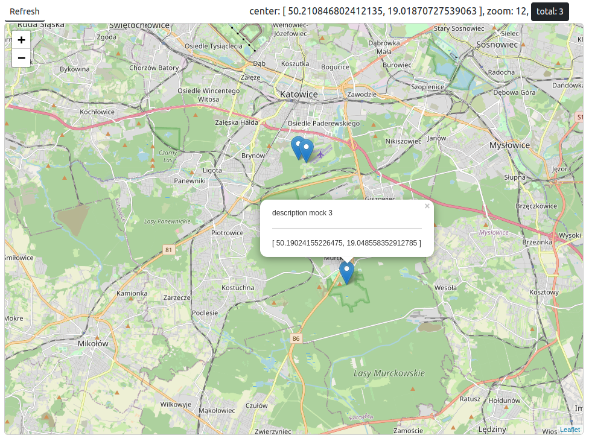

# About 


# Build & run 

```
docker-compose -f docker-compose-build-with-mock.yml up --build
```

open browser at `http://localhost:8080`

You should see something like this

where markers represent data from mock